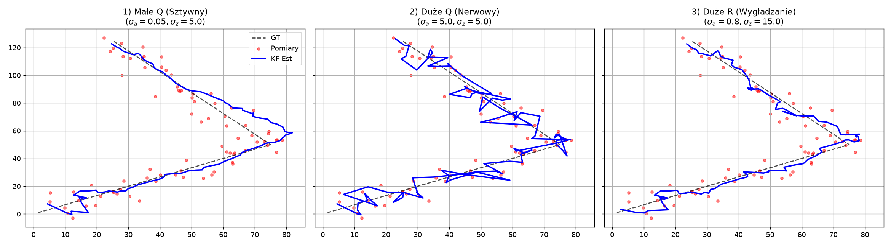

# Computer Vision Lab

Python laboratory experiments in background modeling, motion analysis, object tracking, and segmentation. This repository is a collection of learning scripts, not a packaged video-surveillance service.

[Source](https://github.com/haribo841/Doz-r-wizyjny) | [Experiment guide](docs/USAGE.md) | [Reuse status](docs/USAGE.md#reuse-and-data) | [Report an issue](https://github.com/haribo841/Doz-r-wizyjny/issues)

## What you can explore

- Mean/median background models and foreground subtraction with OpenCV.
- Optical flow, trajectories, counting, and activity heatmaps.
- Linear Kalman filtering and multi-object tracking on synthetic measurements.
- Separate ROI, SAM, U-Net, and image-forgery experiments, with their own input and model requirements.

## Quick start: no camera or dataset needed

The self-contained Kalman simulation is the simplest starting point. It uses generated positions and noisy measurements, not personal recordings.

```powershell
git clone https://github.com/haribo841/Doz-r-wizyjny.git
cd Doz-r-wizyjny
python -m venv .venv
.\.venv\Scripts\Activate.ps1
python -m pip install numpy matplotlib scipy
python "Background modeling/KalmanFilter.py"
```

Close each plot window to continue to the next experiment. To generate just the image below without opening windows, run `python docs/render_kalman_example.py`.

## Example output



Actual output of the existing single-object experiment with its fixed random seed. It compares estimated trajectories, ground truth, and noisy measurements under three Q/R settings. It is not evidence of accuracy on real surveillance video.

## Technologies and platform

Python, NumPy, Matplotlib, and optional SciPy form the synthetic-tracking example. Video experiments additionally use OpenCV; other scripts depend on packages such as pandas, imutils, MediaPipe, PyTorch/SAM, TensorFlow, or Ultralytics. Install only the packages needed by the chosen experiment.

The synthetic example was checked on Windows with Python 3.12 and 3.13. It uses portable libraries, but Linux and macOS were not tested. GUI video scripts need a desktop session. There are no installer packages, binary releases, or shared application entry point.

## Scope and documentation

See the [experiment guide](docs/USAGE.md) for file groups, missing media/models, privacy precautions, and reproduction details. Many older scripts contain local input paths that must be adjusted. Models, external datasets, and private recordings are not included in the quick start.

No repository-wide license has been selected. Ask the author before reuse, and check dataset/model licenses separately. The [previous README](docs/archive/README-2026-09-25.md) is preserved unchanged.

